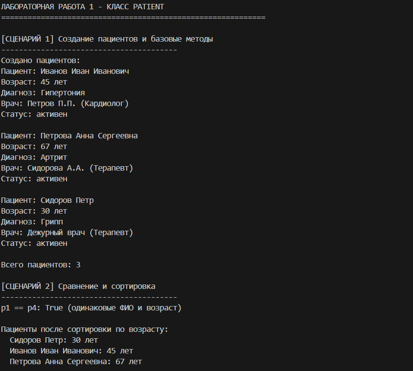

# Лабораторная работа 1: Класс и инкапсуляция

## Тема: Медицина (Patient)

### Описание
Разработка класса `Patient` для работы с данными пациентов медицинского учреждения. Реализованы все требования для оценки "5": инкапсуляция, свойства, магические методы, валидация в отдельном модуле, состояние объекта.

---

## Реализованный функционал

### 1. Модуль валидации (`validate.py`)
- Проверка ФИО (тип, не пустое, мин. 2 символа)
- Проверка возраста (число, диапазон 0-150)
- Проверка диагноза (строка, не пустой, мин. 3 символа)
- Проверка врача (строка, не пустой, мин. 5 символов)
- Проверка специализации (только допустимые значения)
- Проверка статуса (только допустимые значения)
- Проверка даты приема (формат ГГГГ-ММ-ДД, не в прошлом)

### 2. Класс Patient (`model.py`)

**Атрибуты класса:**
- `_count` - счетчик созданных пациентов
- `RETIREMENT_AGE` - пенсионный возраст (65)
- `DEFAULT_DOCTOR` - врач по умолчанию

**Приватные атрибуты:**
- `_name` - ФИО
- `_age` - возраст
- `_diagnosis` - диагноз
- `_doctor` - лечащий врач
- `_doctor_spec` - специализация врача
- `_status` - статус пациента
- `_appointment_date` - дата приема
- `_treatment_history` - история лечения

**Свойства (геттеры и сеттеры):**
- `name` - только чтение
- `age` - только чтение
- `diagnosis` - чтение/запись с валидацией
- `doctor` - чтение/запись с валидацией
- `doctor_spec` - чтение/запись с валидацией
- `status` - чтение/запись с валидацией
- `appointment_date` - чтение/запись с валидацией

**Магические методы:**
- `__str__` - пользовательское представление
- `__repr__` - представление для разработчиков
- `__eq__` - сравнение по ФИО и возрасту
- `__lt__` - сравнение для сортировки по возрасту

**Методы класса:**
- `get_count()` - возвращает количество пациентов
- `from_string()` - создание пациента из строки

**Бизнес-методы:**
- `years_to_retirement()` - лет до пенсии
- `is_senior()` - проверка на пожилого пациента
- `assign_appointment()` - назначение даты приема
- `discharge()` - выписка пациента
- `get_history()` - получение истории лечения

### 3. Демонстрация (`demo.py`)

**Сценарии демонстрации:**

1. **Создание пациентов** - создание объектов с разными параметрами
2. **Сравнение и сортировка** - демонстрация `__eq__` и `__lt__`
3. **Изменение свойств** - работа сеттеров с валидацией
4. **Изменение статуса** - обновление статуса с проверкой
5. **Назначение приема** - установка даты с проверкой на прошлое
6. **Выписка пациента** - изменение статуса с логическим ограничением
7. **История лечения** - отслеживание изменений
8. **Представление для разработчиков** - демонстрация `__repr__`
9. **Альтернативный конструктор** - создание из строки
10. **Проверка валидации** - тестирование обработки ошибок
# Запуск кода: 

# Вывод

В ходе лабораторной работы был разработан класс `Patient` для работы с данными пациентов. Реализованы все требования для оценки "5":

1. **Инкапсуляция** – защищенные атрибуты, доступ через свойства (@property)
2. **Валидация** – вынесена в отдельный модуль, проверка типов, диапазонов, форматов
3. **Магические методы** – `__str__`, `__repr__`, `__eq__`, `__lt__`
4. **Состояние объекта** – статус пациента, история изменений, логические ограничения
5. **Методы класса** – счетчик объектов, альтернативный конструктор

Демонстрационная программа успешно протестировала 10 сценариев работы: создание, изменение данных, сравнение, сортировку, назначение приема, выписку, историю и обработку ошибок. Все функции работают корректно, валидация данных выполняется, исключения обрабатываются.
