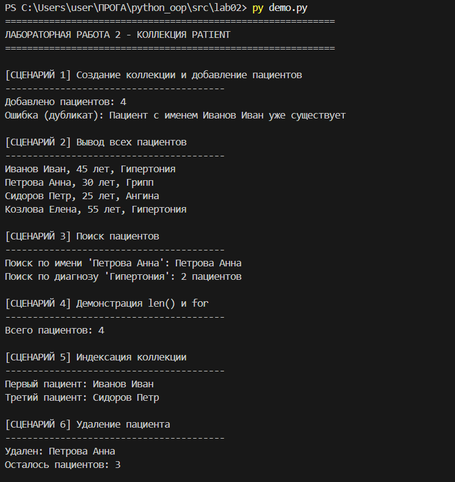

# Лабораторная работа 2: Коллекция PatientCollection

**Предметная область:** Медицина

## Описание

Контейнерный класс `PatientCollection` предназначен для хранения и управления группой объектов `Patient` из лабораторной работы 1. Реализованы все требования для оценки "5".

## Реализованный функционал

### 1. Базовые операции управления коллекцией

- **add** – добавление пациента в коллекцию. Проверяется тип объекта (только Patient) и уникальность имени (нельзя добавить двух пациентов с одинаковым именем)
- **remove** – удаление пациента из коллекции по объекту
- **remove_at** – удаление пациента по индексу с возвратом удаленного объекта
- **get_all** – получение копии списка всех пациентов

### 2. Поиск объектов

- **find_by_name** – поиск пациента по точному совпадению имени (регистронезависимый)
- **find_by_diagnosis** – поиск всех пациентов с указанным диагнозом
- **find_by_doctor** – поиск всех пациентов, прикрепленных к указанному врачу
- **find_by_status** – поиск всех пациентов с определенным статусом

### 3. Сортировка

- **sort_by_age** – сортировка коллекции по возрасту (по возрастанию или убыванию)
- **sort_by_name** – сортировка коллекции по имени в алфавитном порядке
- **sort** – универсальная сортировка с возможностью указать свой ключ

### 4. Фильтрация

- **get_active** – возвращает новую коллекцию, содержащую только активных пациентов (со статусом "активен" или "на лечении")
- **get_by_age_range** – возвращает коллекцию пациентов, возраст которых попадает в заданный диапазон

### 5. Магические методы

- **__len__** – позволяет получить количество пациентов через функцию `len()`
- **__iter__** – позволяет обходить коллекцию в цикле `for`
- **__getitem__** – обеспечивает доступ к элементам по индексу `collection[0]` и поддержку срезов `collection[1:3]`

## Ограничения и проверки

- В коллекцию можно добавлять только объекты класса `Patient`
- Невозможно добавить двух пациентов с одинаковым именем
- При попытке удалить несуществующий объект возникает ошибка
- При обращении по индексу вне границ коллекции возникает ошибка

## Демонстрация

В `demo.py` реализованы 9 сценариев, демонстрирующих все возможности коллекции:

1. Создание коллекции и добавление пациентов с проверкой дубликатов
2. Вывод всех элементов через итерацию
3. Поиск пациентов по имени и диагнозу
4. Использование `len()` и цикла `for`
5. Доступ к элементам по индексу
6. Удаление пациента по индексу
7. Сортировка коллекции по возрасту
8. Фильтрация активных пациентов
9. Фильтрация пациентов по возрастному диапазону
# Вот что они выыводят:

## Вывод
Разработан контейнерный класс `PatientCollection` для управления объектами `Patient`. Реализованы добавление, удаление, поиск, сортировка, фильтрация, а также магические методы `__len__`, `__iter__`, `__getitem__`. Все 9 сценариев демонстрации выполнены успешно, ограничения и проверки работают корректно.