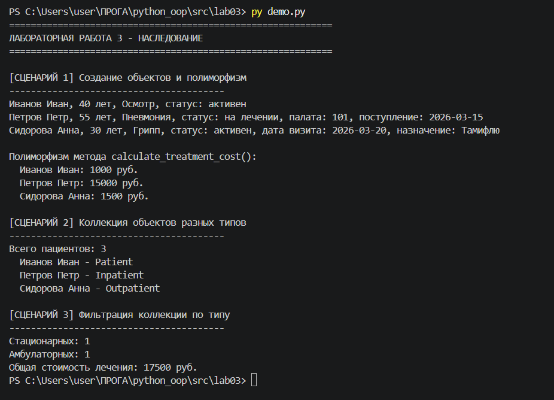

# Лабораторная работа 3: Наследование и иерархия классов

**Предметная область:** Медицина

## Цель работы

Освоить механизм наследования классов, научиться строить иерархию объектов, переопределять методы и использовать полиморфизм.

## Иерархия классов

**Базовый класс Patient** (из ЛР-1)

Атрибуты: name, age, diagnosis, doctor, doctor_spec, status, appointment_date, treatment_history

Методы: years_to_retirement(), assign_appointment(), discharge(), get_history(), calculate_treatment_cost()

**Производный класс Inpatient** (стационарный пациент)

Дополнительные атрибуты: room_number (номер палаты), admission_date (дата поступления)

Переопределенные методы: discharge(), calculate_treatment_cost(), __str__

Особенности: стоимость лечения 5000 + 1000 за день

**Производный класс Outpatient** (амбулаторный пациент)

Дополнительные атрибуты: visit_date (дата визита), prescription (назначение)

Дополнительные методы: assign_prescription()

Переопределенные методы: calculate_treatment_cost(), __str__

Особенности: стоимость лечения фиксированная - 1500 руб.

## Полиморфизм

Метод calculate_treatment_cost() работает по-разному для разных типов:
- Patient: 1000 руб.
- Inpatient: 15000 руб.
- Outpatient: 1500 руб.

## Интеграция с коллекцией (ЛР-2)

Коллекция PatientCollection адаптирована для хранения объектов разных типов. Добавлены методы:
- get_by_type(class_type) - фильтрация по типу
- get_inpatients() - получить только стационарных
- get_outpatients() - получить только амбулаторных
- calculate_total_cost() - общая стоимость лечения

## Демонстрация

В demo.py реализованы 3 сценария:

1. **Создание объектов и полиморфизм** - создание Patient, Inpatient, Outpatient, демонстрация разного поведения calculate_treatment_cost()

2. **Коллекция объектов разных типов** - добавление всех типов в одну коллекцию, вывод через итерацию

3. **Фильтрация коллекции по типу** - отбор только стационарных или только амбулаторных пациентов, расчет общей стоимости

## Вывод

Разработана иерархия классов Patient → Inpatient, Outpatient. Реализованы наследование, переопределение методов, полиморфизм. Коллекция из ЛР-2 адаптирована для хранения объектов разных типов с возможностью фильтрации. Все 3 сценария демострации работают.