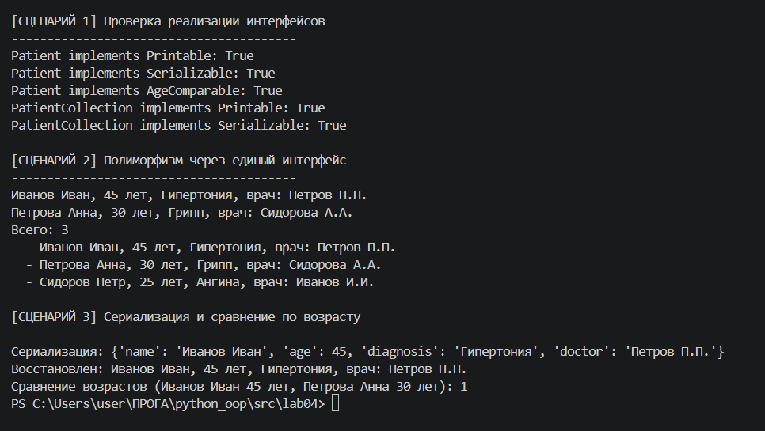

# Лабораторная работа 4: Интерфейсы и абстрактные классы (ABC)

**Предметная область:** Медицина

## Цель работы

Изучение абстрактных базовых классов (ABC), создание интерфейсов (контрактов поведения), реализация полиморфизма через единый интерфейс.

## Реализованные интерфейсы

| Интерфейс | Методы | Назначение |
|-----------|--------|-------------|
| `Printable` | `get_printable_info() -> str` | Возвращает строковое представление объекта |
| `Serializable` | `to_dict() -> dict`, `from_dict(data: dict)` | Сериализация и десериализация |
| `AgeComparable` | `compare_age(other) -> int` | Сравнение объектов по возрасту |

## Реализация в классах

### Класс `Patient`
- `Printable` → выводит ФИО, возраст, диагноз, врача
- `Serializable` → преобразование в словарь и обратно
- `AgeComparable` → сравнение пациентов по возрасту

### Класс `PatientCollection`
- `Printable` → выводит количество пациентов и их список
- `Serializable` → сериализация всей коллекции

## Демонстрация (3 сценария)

1. **Проверка реализации интерфейсов** - `isinstance()` для всех классов
2. **Полиморфизм через интерфейс** - единая функция для разных типов объектов
3. **Сериализация и сравнение** - преобразование в словарь и сравнение по возрасту

## Универсальные функции

- `print_all(items)` - принимает список `Printable` объектов и выводит их

## Вывод

Разработаны три интерфейса (`Printable`, `Serializable`, `AgeComparable`), реализованные в классах `Patient` и `PatientCollection`. Демонстрируется полиморфизм через единый интерфейс, сериализация объектов и сравнение по возрасту.