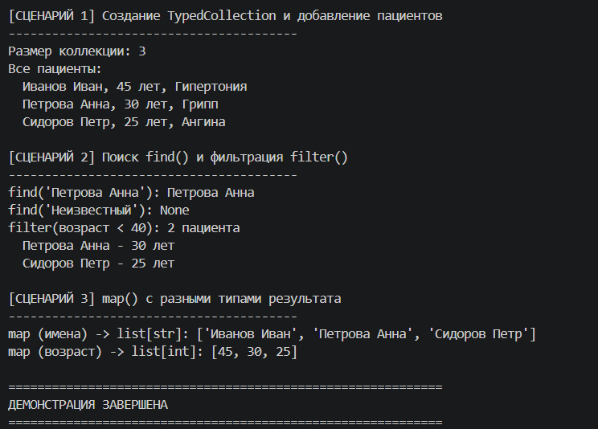

# Лабораторная работа 6: Generics и typing

**Предметная область:** Медицина

## Цель работы

Освоение системы аннотаций типов в Python, создание обобщенных (generic) классов с помощью TypeVar и Generic.

## Реализованные типы и контейнеры

### Generic-класс TypedCollection[T]
Типизированная коллекция, хранящая элементы определенного типа.

**Методы:**
- `add(item: T) -> None` - добавление элемента
- `remove(item: T) -> None` - удаление элемента
- `remove_at(index: int) -> T` - удаление по индексу
- `get_all() -> list[T]` - получение всех элементов
- `find(predicate: Callable[[T], bool]) -> Optional[T]` - поиск элемента
- `filter(predicate: Callable[[T], bool]) -> list[T]` - фильтрация
- `map(transform: Callable[[T], R]) -> list[R]` - преобразование с изменением типа
- `sort(key_func: Callable[[T], any], reverse: bool) -> None` - сортировка

## Демонстрация (3 сценария)

### Сценарий 1: Создание Generic коллекции
Создание TypedCollection[Patient], добавление 3 пациентов, вывод всех элементов.

### Сценарий 2: Поиск и фильтрация
- `find()` - поиск существующего и несуществующего элемента
- `filter()` - отбор пациентов младше 40 лет

### Сценарий 3: map с изменением типа
- Преобразование в список имен (list[str])
- Преобразование в список возрастов (list[int])

## Вывод

Изучены аннотации типов, Generic-классы, TypeVar. Реализована типизированная коллекция с методами find, filter, map. Продемонстрировано изменение типа результата при использовании map.