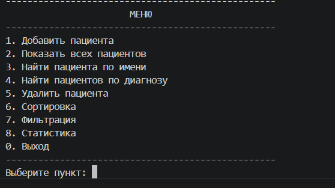

# Лабораторная работа 7: Консольное приложение

**Предметная область:** Медицина

## Цель работы

Объединение всех знаний из ЛР1-ЛР6 в единое интерактивное CLI-приложение. Реализация интерактивного интерфейса с меню, обработкой ошибок, сохранением и загрузкой данных.

## Структура проекта

| Файл | Назначение |
|------|-------------|
| `main.py` | Точка входа, запуск приложения |
| `cli.py` | Интерфейс: меню, ввод, вывод, форматирование |
| `app.py` | Бизнес-логика, управление данными |
| `models.py` | Класс Patient (предметная область) |
| `collection.py` | Класс PatientCollection |
| `strategies.py` | Функции сортировки и фильтрации |
| `storage.py` | Сохранение и загрузка из JSON |
| `validate.py` | Валидация входных данных |
| `exceptions.py` | Собственные исключения |

## Реализованный CLI

### Пункты меню

1. **Добавить пациента** - ввод данных с валидацией, проверка на дубликаты
2. **Показать всех пациентов** - вывод таблицы всех пациентов
3. **Найти пациента по имени** - поиск и вывод информации
4. **Найти пациентов по диагнозу** - поиск всех с указанным диагнозом
5. **Удалить пациента** - поиск, подтверждение, удаление
6. **Сортировка** - подменю: по имени (А-Я/Я-А), по возрасту (молодые/пожилые)
7. **Фильтрация** - подменю: по статусу, по диапазону возраста
8. **Статистика** - количество пациентов, средний возраст, распределение по статусам
0. **Выход** - сохранение данных в файл

### Обработка ошибок

- Неверный пункт меню
- Ввод строки вместо числа
- Поиск несуществующего пациента
- Добавление дубликата
- Собственные исключения: `ItemNotFoundError`, `DuplicateItemError`

### Сохранение и загрузка

- Автоматическая загрузка данных из `data.json` при запуске
- Автоматическое сохранение при добавлении, удалении и выходе
- Формат: JSON

## Демонстрация (8 сценариев)

### Сценарий 1: Добавление пациента
Ввод ФИО, возраста, диагноза, врача, статуса. При успехе - вывод добавленного пациента.

### Сценарий 2: Показ всех пациентов
Вывод таблицы с именем, возрастом, диагнозом, статусом.

### Сценарий 3: Поиск по имени
Поиск существующего пациента - вывод информации. Поиск несуществующего - сообщение об ошибке.

### Сценарий 4: Поиск по диагнозу
Вывод всех пациентов с указанным диагнозом.

### Сценарий 5: Удаление пациента
Поиск, подтверждение (y/n), удаление.

### Сценарий 6: Сортировка
Выбор стратегии сортировки (имя/возраст, прямой/обратный порядок).

### Сценарий 7: Фильтрация
Фильтр по статусу или по диапазону возраста.

### Сценарий 8: Статистика и выход
Статистика по коллекции, сохранение данных при выходе.

## Вывод

Изучены:
- Разбиение на модули и слои (CLI, бизнес-логика, хранение)
- Интерактивный CLI с циклом обработки команд
- Обработка исключений и валидация ввода
- Сохранение и загрузка данных в JSON
- Использование всех ранее разработанных компонентов (ЛР1-ЛР6)